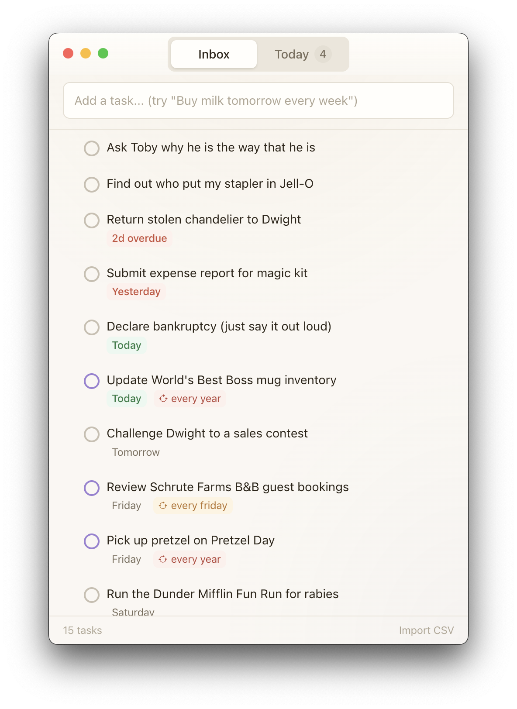

# WillDo

A local-first todo app for macOS, built to replace Todoist. Natural language task entry, recurring tasks, drag-to-reorder, dock badge, and a menu bar icon.


<p align="center">
  
</p>

## Features

- **Natural language input** — type "File taxes by April 15 every quarter" and it parses the title, date, and recurrence
- **Time support** — "Pick up Joe at 5.30 today" parses to 5:30 PM. Hours 1–7 and 12 default to PM when AM/PM isn't specified; both 12h and 24h input formats supported
- **Recurring tasks** — daily, weekly, monthly, quarterly, yearly with automatic next-date computation
- **Drag-to-reorder** — fractional indexing for smooth reordering
- **Two views** — Inbox (all tasks, no-date first for triage) and Today (due today + overdue)
- **Mobile PWA** — add and view tasks from your phone via a Progressive Web App synced through Cloudflare Workers + D1
- **Dock badge** — shows count of tasks due today
- **Menu bar icon** — quick glance at due tasks from the system tray
- **Task editing** — calendar date picker, time picker, recurrence presets, inline title editing
- **Color-coded recurrence** — different colors for daily, weekly, monthly, quarterly, yearly
- **CSV import** — import tasks from Todoist CSV exports
- **Claude Code skill** — query and manage tasks from the terminal with `/todo`

## Tech Stack

- **Electron** via electron-vite (React + TypeScript + Vite)
- **better-sqlite3** — local SQLite database in the main process, IPC bridge to renderer
- **chrono-node** — natural language date parsing
- **rrule.js** — RFC 5545 recurrence rule computation
- **@dnd-kit** — drag-to-reorder with sortable contexts
- **Tailwind CSS v4** — "Golden Hour" warm theme
- **Cloudflare Workers + D1** — cloud sync backend for the mobile PWA

## Getting Started

### Desktop App (macOS)

```bash
# Install dependencies
pnpm install

# Run in development mode with HMR
pnpm dev

# Build for production
pnpm build

# Package as macOS .dmg
pnpm package
```

### Mobile PWA

The PWA is deployed to GitHub Pages and syncs tasks through a Cloudflare Worker.

```bash
# Deploy the worker (requires Cloudflare account + wrangler auth)
cd worker
npx wrangler d1 execute willdo-sync --remote --file=./migrations/0001_init.sql
npx wrangler d1 execute willdo-sync --remote --file=./migrations/0002_add_time.sql
npx wrangler deploy

# Build the PWA locally
pnpm --filter @willdo/pwa build
```

On first launch, the PWA prompts for the Worker URL and API key. These are stored in the browser's localStorage — no credentials are committed to the repo.

### Cloud Sync Setup

1. Set an API key secret on the worker: `npx wrangler secret put API_KEY`
2. In the desktop app, open Settings and enter the Worker URL and API key
3. The desktop app pushes task state to the cloud on every mutation and polls for mobile-created tasks every 60 seconds

## Database

SQLite database stored at `~/Library/Application Support/willdo/willdo.db`. Tables:

- **tasks** — id, title, due_date, due_time, rrule, rrule_human, is_recurring, is_completed, sort_order
- **completions** — logs each task completion with timestamp and due_date snapshot
- **settings** — key/value store

## Claude Code Skill

To enable the `/todo` skill, symlink it into your Claude Code skills directory:

```bash
ln -s $(pwd)/skill/willdo-todo ~/.claude/skills/willdo-todo
```

Then use `/todo` from Claude Code to manage tasks without opening the app:

```
/todo              # list tasks due today
/todo list         # list all tasks
/todo add Buy milk tomorrow
/todo done milk
/todo search taxes
```

## Built With

Built entirely with [Claude Code](https://claude.ai/claude-code) in a single session.
